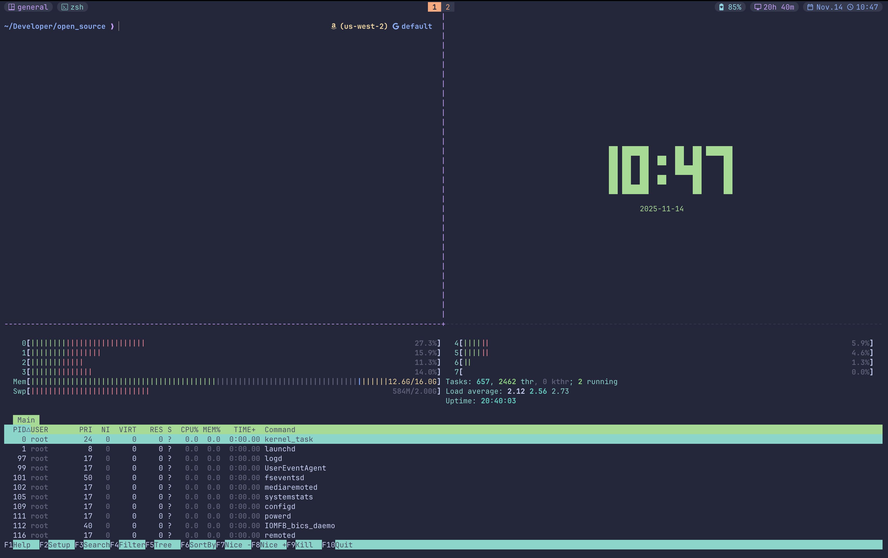

# Dotfiles


Personal collection of cli customizations and utilities from over 4 years, paired with modern tools. A minimal, modern terminal setup with Catppuccin theming for zsh, tmux, and ghostty. Optimized for macOS but adaptable to any system with zsh.

**Demo**


**Screenshot**


**Wallpaper**


## TLDR
- [Prerequisites](#prerequisites)
- [Installation](#installation)
- [Features](#features)
- [Customization](#customization)
- [Useful Commands](#useful-commands)


## Prerequisites

### Required
- **zsh** - Modern shell (usually pre-installed on macOS)
- **git** - Version control system
- **Font with ligatures** - Recommended for displaying special characters. Recommended font: [JetBrains Mono](https://www.jetbrains.com/lp/mono)
- **[Homebrew](https://brew.sh)** (macOS) or equivalent package manager

### CLI Tools to Install
```bash
# Install via Homebrew on macOS
brew install fzf zoxide starship carapace-sh/tap/carapace
```

- **[fzf](https://github.com/junegunn/fzf)** - Command-line fuzzy finder
- **[zoxide](https://github.com/ajeetdsouza/zoxide)** - Smarter cd command
- **[starship](https://starship.rs)** - Cross-shell prompt
- **[carapace](https://carapace-sh.github.io/carapace-bin/carapace-bin.html)** - Multi-shell argument completions

### Optional
- **[tmux](https://github.com/tmux/tmux)** - Terminal multiplexer (for managing multiple terminal sessions)
- **[ghostty](https://github.com/ghostty-org/ghostty)** - GPU-accelerated terminal emulator

## Installation

1. **Clone the repository**
   ```bash
   git clone https://github.com/hope-ag/dotfiles.git ~/.dotfiles
   cd ~/.dotfiles
   ```

2. **Link configurations**
   ```bash
   # Link all configs at once
   make linkall
   
   # Or link individually
   make linkzshrc    # Link zsh configuration
   make linktmux     # Link tmux configuration
   make linkghostty  # Link ghostty configuration
   make linkstarship # Link starship configuration
   ```

   Note: The Makefile will automatically backup any existing configurations before linking.

3. **Restart your terminal** or source the configuration
   ```bash
   source ~/.zshrc
   ```

## Features

### 🎨 Catppuccin Theme

Beautiful, soothing pastel theme applied consistently across:
- Terminal prompt (via Starship)
- fzf fuzzy finder interface
- tmux status bar and windows
- Syntax highlighting in shell
- Ghostty terminal colors

### 🌿 Git Workflow Enhancements

**Branch Management with Worktrees**
- `spawn <branch>` - Create a new worktree for a branch
- `list-spawns` - List all active worktrees
- `despawn <path>` - Remove a worktree

**Example workflow:**
```bash
# Working on main branch, need to review a PR
spawn feature-branch
cd ../feature-branch
# Make changes, test, review
cd ../main
despawn ../feature-branch
```

**Quick Git Commands**
- `gpull` - Pull from remote
- `gpush` - Push to remote
- `push-branch` - Push current branch to origin
- `gcd` - Checkout development branch
- `gcm` - Checkout master branch
- `gpod` - Pull origin development

**Stash Management:**
- `stash-all` - Stash all changes including untracked
- `apply-latest` - Apply most recent stash

### 🔍 fzf Integration

**Key Bindings**
- `Ctrl+R` - Fuzzy search command history
- `Ctrl+T` - Fuzzy find files in current directory
- `Tab` - Trigger fzf-tab for completions

**Features**
- Catppuccin-themed interface
- Preview windows for files
- Smart tab completions with fzf-tab
- Integration with git, docker, and more

### ⚡ zoxide - Smarter Navigation

**Usage**
```bash
# First time visiting a directory
cd ~/Projects/my-awesome-project

# Later, from anywhere
cd awesome  # Jumps directly to ~/Projects/my-awesome-project

# Interactive selection when multiple matches
cdi proj  # Shows interactive menu of directories matching "proj"
```

### ✨ Starship Prompt

**Features**
- Git branch and status indicators
- Current directory with smart truncation
- Language version indicators (Node, Python, Rust, etc.)
- Command execution time
- Exit code indicators
- Fully customizable via `~/.config/starship/starship.toml`

### 🎯 Carapace Completions

Advanced command-line completions for 500+ CLI tools.

**Examples:**
```bash
git checkout <Tab>  # Shows branches with descriptions
docker run <Tab>    # Shows available images
npm run <Tab>       # Shows package.json scripts
```

### 🖥️ tmux Configuration (Optional)
The main demo uses tmux heavily.

**Features**
- Catppuccin theme integration
- Sensible defaults via tmux-sensible
- Session restoration with tmux-resurrect
- Enhanced copy/paste with tmux-yank
- fzf integration for session/window/pane management
- Plugin management via [tpm](https://github.com/tmux-plugins/tpm)

### 👻 Ghostty Terminal (Optional)
Modern GPU-accelerated terminal with advanced features.

**Features**
- Transparent background with blur (optional)
- Focus follows mouse
- Catppuccin color scheme
- Maximized window by default

### 🔧 Zsh Enhancements
Powerful shell enhancements for productivity.

**Plugins:**
- **zsh-autosuggestions** - Fish-like suggestions as you type
- **zsh-syntax-highlighting** - Real-time syntax highlighting
- **zsh-history-substring-search** - Search history with arrow keys
- **fzf-tab** - Replace default tab completion with fzf

**History:**
- 200,000 line history with deduplication
- Substring search with highlighted matches
- Shared history across sessions

### 🛠️ Development Tools Support

Pre-configured support for various development environments.

**Included (commented out by default):**
- Node Version Manager (NVM) - Lazy loaded for performance
- pnpm package manager
- Android SDK
- Go development environment
- Bun JavaScript runtime
- Docker and AWS CLI completions
- Terraform completions

## Customization

### Enabling Optional Features

Edit `~/.zshrc` to uncomment desired features:

```bash
# For Homebrew on macOS
export PATH="$HOME/.local/bin:$PATH"
eval $(/opt/homebrew/bin/brew shellenv)

# For pnpm
export PNPM_HOME="$HOME/Library/pnpm"
export PATH="$PNPM_HOME:$PATH"

# For Go development
export PATH="$HOME/go/bin:$PATH"
```

### Ghostty Transparency

Edit `~/.config/ghostty/config`:
```bash
# Uncomment for transparent background
background-opacity=0.9
background-blur=30
```

### Adding Custom Aliases

Add your aliases to the end of `~/.zshrc`:
```bash
# Custom aliases
alias myproject='cd ~/Projects/my-project'
alias dev='npm run dev'
```

## Useful Commands

### System Information
- `ip` - Show your public IP address
- `weather-in <city>` - Get weather for any city
- `docs` - Fuzzy search and open man pages

### Docker
- `dcrm <container>` - Remove docker container

### File Management
- `ls` - Colorized ls output (uses eza if available)

## Troubleshooting

### Zinit Installation
If zinit fails to install automatically, run:
```bash
git clone https://github.com/zdharma-continuum/zinit.git ~/.local/share/zinit/zinit.git
```

### Slow Terminal Startup
- NVM is lazy-loaded by default
- Check for slow custom scripts in `.zshrc`
- Run `zprof` (uncomment first/last lines in .zshrc) to profile startup

### FZF Key Bindings Not Working
Ensure fzf is properly installed:
```bash
$(brew --prefix)/opt/fzf/install
```

## Contributing

Feel free to fork and customize these dotfiles for your own use! Pull requests for improvements are welcome.

## License

MIT - See LICENSE file for details

